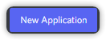
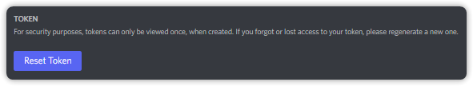
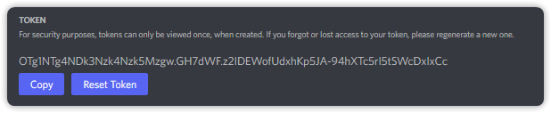

# Creating your first project

## The basics

#### First Of All you would Need a Bot&#x20;

* Go to the [Developers Portal](https://discord.com/developers/applications)
* Make an Application \
  \- 
* Scroll Down to Find **Bots**\
  \- 

* Click On **Reset Token**

* Your Token Will Appear after the "Reset Token Process"

