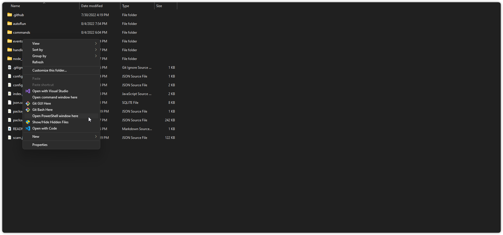
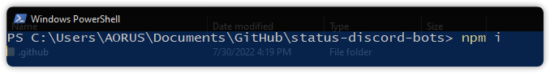
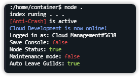

# Starting The Bot Up


NodeJS Version 16 + is Required to Run this Bot. Get NodeJS Here : [https://nodejs.org/](https://nodejs.org/en/)


### Installing the Required Packages

* [ ] Go to your Directory and Right Click and Click on "Open Powershell window here"

* [ ] Then Type in `npm i` in the powershell window

* [ ] After all Packages are Downloaded Start the Bot with `node index.js` in the Powershell Window

Your Bot should be Running Now! &#x20;
